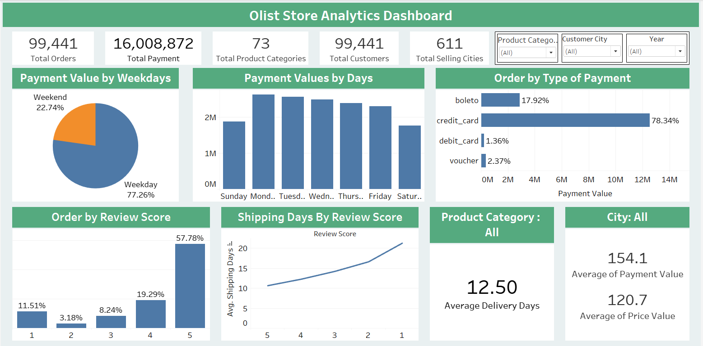

# Olist E-commerce Store Analysis using Tableau

## Dashboard Link

[Tableau Dashboard](https://public.tableau.com/views/OlistStoreProjectDashboard/Dashboard1?:language=en-US&:sid=&:redirect=auth&:display_count=n&:origin=viz_share_link)

## Overview 

The Tableau-powered dashboard is designed to serve as a comprehensive decision-making platform, enabling stakeholders to analyze sales performance, customer behavior, and inventory management effectively. This tool leverages historical and real-time data to provide actionable insights that enhance forecasting, align business strategies, and drive overall growth.

## Objectives

- Provide a platform to gain actionable insights into sales performance, customer behavior, and inventory management to optimize decision-making and drive business growth.
- Empower decision-makers with easily accessible, visually appealing insights to support strategic and tactical decisions.
- Utilize historical and current sales data to enhance forecasting accuracy, set realistic sales targets, and align the sales team's efforts with the company's strategic objectives.

## Schema 

## Business Problems and Solutions 

## 1. Find Sales and Customer Data Overview
**Objective:** Provide a high-level summary of key metrics like total orders, total payments, total product categories, total customers and total selling cities.

 **Visualization:** KPIs for total orders, total payments, total product categories, total customers and total selling cities.
                   Filters for segmentation by product category, customer city and year.

**Key Insights:** There are more than 99k orders placed with 16M+ payment amount, where olist store provides 73 total product categories with 99k+ customers across globe in 611 cities.

## 2. Find Weekday Vs Weekend Payment Statistics
**Objective:** Compare customer spending patterns between weekdays and weekends.

**Visualization:** A pie chart displaying the percentage contribution of payment values split by weekdays and weekends.

**Key Insights:** The pie chart shows that the majority of payments (77%) are made on weekdays.

## 3. Find day wise Payment Statistics
**Objective:** Assess payment value trends across individual weekdays.

**Visualization:** A column chart showing payment values for each day of the week.

**Key Insights:**
- The bar chart shows details of each day payment statistics.
- The highest payments of the week occurred on Tuesday with 366.38k and Thursday with 349.4k.
- The lowest payments were on the weekend, with Sunday at 269k and Saturday at 229k.

## 4. Find the number of Orders and its payment type 
**Objective:** Compare the number of orders completed using different payment methods such as credit cards, debit cards, vouchers, and Boleto.

**Visualization:** A horizontal bar chart showing order counts for each payment type.

**Key Insights:**
- Credit card is the most popular payment method, the payment type credit card made around 78% of orders.
- Boleto is the second most popular payment, This boleto made around 18 % of orders.
- Other payment methods, such as Voucher and Debit card are less popular forms of payment.

## 5. Find the average number of days taken for order delivered customer date for pet shop
**Objective:** Analyze how product review scores (ranging from 1 to 5) correlate with order volume.

**Visualization:** A kpi built for average days taken for order delivered customer date.
                   Filters for segmentation by product category.  

**Key Insights:**
- 11.31 is the average days taken to deliver the order for pet shop.
- However for all categories, Average delivery days is 12.50 days.

## 6. Find the average price and payment values from customers of sao paulo city

**Objective:** Show city-wise insights for the average payment value and average product price.

**Visualization:** Two KPI cards with city-based filtering for deeper insights.

**Key Insights:**
- Particularly for sao paulo city average price value is 107.5
- Average payment value in sao paulo city is 135.8

## 7. Find the relationship between Orders and Review scores

**Objective:** Analyze how product review scores (ranging from 1 to 5) correlate with order volume.

**Visualization:** A column chart with review scores on the x-axis and order counts on the y-axis.

**Key Insights:** A column chart shows rating of 1 corresponds to the longest average shipping time of 13.4 days, while a rating of 5 corresponds to the shortest average shipping time of 6.9 days.

## 8. Find the relationship between Shipping days and Review scores

**Objective:** Examine the relationship between average shipping time and product review scores over time.

**Visualization:** A dual axes line chart showing average shipping days and corresponding review scores.

**Key Insights:** A line chart shows rating of 1 corresponds to the longest average shipping time of 21.25 days, while a rating of 5 corresponds to the shortest average shipping time of 10.62 days.

## Conclusion and Learnings:

- Given the strong weekday payment trends, consider tailoring marketing efforts and promotions to weekdays to further boost sales.
- Continue to prioritize and promote the most popular payment methods like credit cards.
- For pet shop products, explore opportunities to further reduce delivery times, as this has been well-received by customers.
- In Sao Paulo city, to ensure competitive and attractive pricing for customers while maintaining profitability.
- Consider conducting customer surveys or feedback analysis to identify areas for improvement and enhance overall customer experience.
- Continuously analyze and assess sales data to adapt strategies to changing market conditions and customer preferences.
- Gained expertise using different Analytical tools to clean and manipulate the dataset and create meaningful visualizations.

